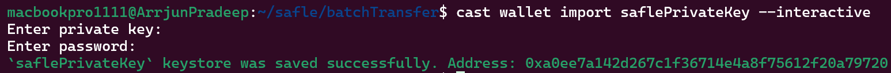

## BatchTransfer Smart Contract [[Link](https://sepolia.etherscan.io/address/0xe69dbc3ca1a2e23eb0db04b59dd490dcf55e5e97#code)]

**Batching contract to facilitate Ethereum (ETH) transactions in batches**

## Usage

### Format

To format the Solidity source files, run:

```shell
$ forge fmt
```

### Build

To compile the BatchTransfer smart contract, use the following command:

```shell
$ forge build
```

### Configure .env file

Configure .env within the root directory of repository

`TEST_PRIVATE_KEY=XXXXXX`
`PRIVATE_KEY=XXXXXX`
`RPC_URL=XXXXXX`
`SEPOLIA_RPC_URL=XXXXXX`
`ETHERSCAN_API_KEY=XXXXXX`

```shell
$ vi .env
$ source .env
``` 

### Deploy and Verify

To deploy and verify the BatchTransfer smart contract on the Sepolia Testnet, execute:

```shell
$ forge script script/batchTransfer.s.sol --rpc-url $SEPOLIA_RPC_URL --private-key $PRIVATE_KEY --broadcast --verify --etherscan-api-key $ETHERSCAN_API_KEY
```

**Note** : The `privateKey` is added in the .env file for development purposes only. For production environments, it is recommended to use the `cast` tool of foundry as shown below:

```shell
$ cast wallet import privateKey --interactive
``` 


## Using docker [Optional]

### Pull the batchtransfer image
```shell
$ docker pull arrjunpradeep/batchtransfer:latest
``` 

### Pull the batchtransfer image
```shell
$ docker pull arrjunpradeep/batchtransfer:latest
``` 

### Configure .env file within the directory 

`TEST_PRIVATE_KEY=XXXXXX`
`PRIVATE_KEY=XXXXXX`
`RPC_URL=XXXXXX`
`SEPOLIA_RPC_URL=XXXXXX`
`ETHERSCAN_API_KEY=XXXXXX`

```shell
$ vi .env
$ source .env
``` 

### Run the container for deploying and verifying the smart contract 
```shell
$ docker run arrjunpradeep/batchtransfer --rpc-url $SEPOLIA_RPC_URL --private-key $PRIVATE_KEY ./src/batchTransfer.sol:BatchTransfer --verify --etherscan-api-key $ETHERSCAN_API_KEY
``` 


